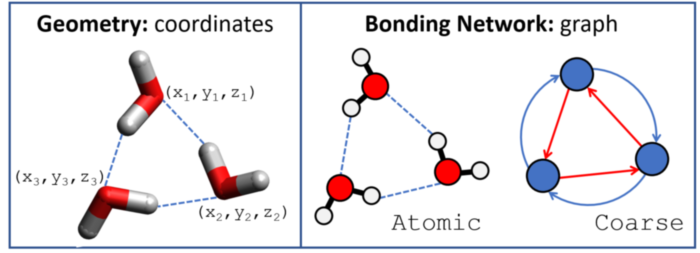
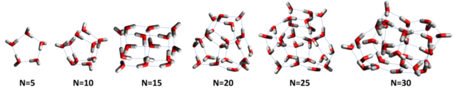
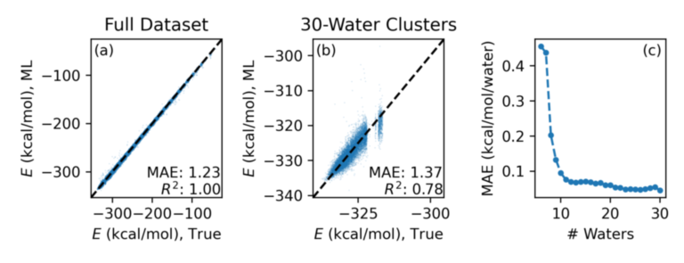

## HydroNet Benchmark

The HydroNet benchmark defines a series of challenge problems around predicting stable clusters of water molecules.

Water is fantastically complex for reasons that [science is yet to fully understand](http://www1.lsbu.ac.uk/water/water_anomalies.html). Many of these unique (and important!) properties are driven by the intricate structures formed by water molecules due to its atypical bonding structure. HydroNet challenges are designed to improve scientist"s ability to predict such structures and, thereby, unravel more mysteries about why water is weird.

## Background

Data for the HydroNet benchmark is based on [a study of low-lying energy geometries](https://aip.scitation.org/doi/10.1063/1.5128378)  from the Jawaharlal Nehru University, University of Washington, and Pacific Northwest National Laboratory. The master dataset used to generate our benchmarks is available from [WDBase](https://sites.uw.edu/wdbase/).

Each entry represents a different bonding network of water clusters that were generated using a Monte Carlo basin paving algorithm to capture not just the most-stable networks but also a robust sampling of near-best networks. The energies for each structure here are computed with [TTM2.1.F](https://pubs.acs.org/doi/abs/10.1021/jp056477k) - a very fast method for computing the energy of geometries of water clusters.

## Challenge Problems



Our challenge problem is broken into three sub challenges. 

Data for each problem are available in JSON (`*.json.gz`) and Tensorflow ProtoBuf (`*.proto`) format [*on a Globus Endpoint*](https://app.globus.org/file-manager?origin_id=e38ee745-6d04-11e5-ba46-22000b92c6ec&origin_path=%2Fexalearn-design%2Fneurips%2Fdata%2Foutput%2F). We provide each challenge in predefined train, test, and validation splits.

### Challenge 1: Predict Energy from Geometry

A simple problem with many subtleties: predict the energy of a molecule given its structure.

All files have a prefix of `geom_` (e.g., `geom_train.json.gz`) and contain records similar to:

```json
{
    "z": [8, 1, 1, 8, 1, 1, 8, 1, 1],
    "n_water": 3,
    "n_atom": 9,
    "atom": [0, 1, 1, 0, 1, 1, 0, 1, 1],
    "coords": [[25.3875809, 2.28446364, 8.01933861],
               [24.686451, 2.11461496, 7.36908007],
               [26.1070786, 1.70453322, 7.77935553],
               [22.9643402, 1.68695939, 6.75715494],
               [22.7494984, 1.67431045, 7.70416498],
               [22.2382431, 2.13693213, 6.33168697],
               [23.0780773, 1.86950338, 9.5477314],
               [22.9238548, 2.4637537, 10.2781725],
               [23.9850082, 2.04813766, 9.2500248]],
    "energy": -15.9416428
}
```

that contain the types and 3D coordinates of each atom along with the energy.

### Challenge 2: Predict Energy from Graph

The bonding network of a water cluster defines its 3D geometry. Eliminating the need to determine 3D coordinates accelerates testing candidate cluster structures.

We present two versions: 

1. One node _per atom_ and bonds define covalent or hydrogen bonds. *Prefix*: `atomic_`

```json
{
    "n_water": 3,
    "n_atom": 9,
    "n_bond": 18,
    "atom": [0, 1, 1, 0, 1, 1, 0, 1, 1],
    "bond": [0, 0, 1, 0, 1, 0, 0, 0, 1, 0, 1, 0, 0, 0, 1, 0, 0, 1],
    "connectivity": [[0, 1], [0, 2], [0, 8], [1, 0], [1, 3],
                     [2, 0], [3, 1], [3, 4], [3, 5], [4, 3],
                     [4, 6], [5, 3], [6, 4], [6, 7], [6, 8],
                     [7, 6], [8, 0], [8, 6]],
    "energy": -15.9416428
}
```

2. One node _per water_ and bonds define whether water donates or accepts a hydrogen bond. *Prefix*: `coarse_`

```json
{
    "n_water": 3,
    "n_atom": 3,
    "n_bond": 6,
    "atom": [0, 0, 0],
    "bond": [0, 1, 1, 0, 1, 0],
    "connectivity": [[0, 1], [0, 2], [1, 0], [1, 2], [2, 0], [2, 1]],
    "energy": -15.9416428
}
```

### Challenge 3: Generating Low-Energy Clusters

The number of possible water clusters explodes combinatorially with the number of water molecules. Finding the lowest-energy structures in this space is a grand challenge in science. 



## Example Solutions

We provide a few example solutions along with the data.

## Challenge 1

We’ve published in the [Journal of Chemical Physics](https://aip.scitation.org/doi/10.1063/5.0009933) and provide [an implementation](https://github.com/exalearn/molecular-graph-descriptors) of an example solution for Challenge 1. 

The model is based on the Continuous-Filter Convolutional Neural Network (i.e., [SchNet](https://aip.scitation.org/doi/10.1063/1.5019779)), as implemented via [SchNetPack](https://schnetpack.readthedocs.io/), and was analyzed using graph-theoretical descriptors. Code for the computation of which is also provided [on GitHub](https://github.com/exalearn/molecular-graph-descriptors).

## Challenge 2

Our [GitHub repository](https://github.com/exalearn/hydronet) provides example solutions for Challenge 2.

The models are based on the [Message-Passing Neural Network (MPNN) of Gilmer et al.](https://arxiv.org/abs/1704.01212) following a Tensorflow 2 implementation from [`github.com/NREL/nfp`](https://github.com/NREL/nfp).

Assessing the performance of the model requires assessing the error within clusters of the same size. For example, we achieve an MAE of 1.23 kcal/mol and an R<sup>2</sup> of greater than 0.99 when measured across the whole dataset, but only a R<sup>2</sup> for clusters of 30 water molecules.

